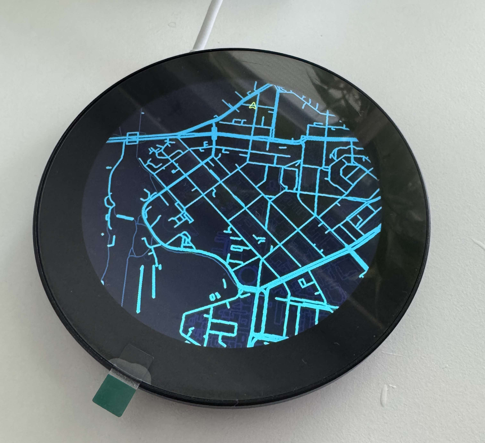
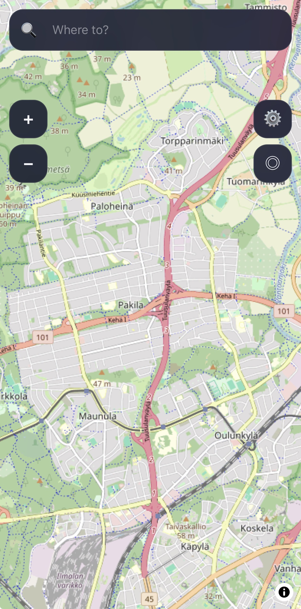
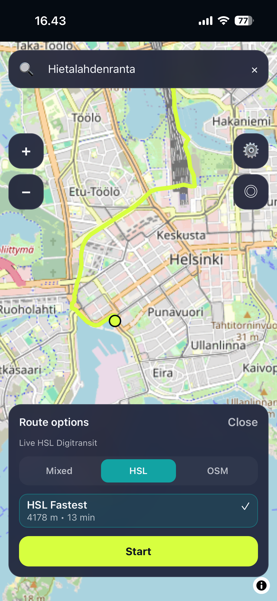
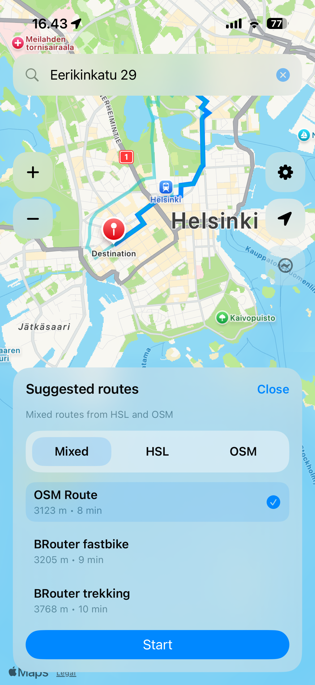
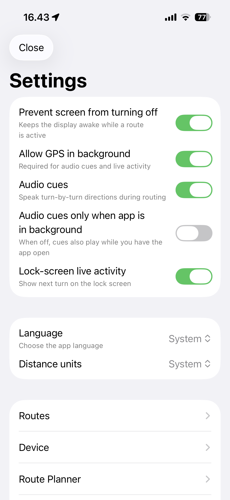
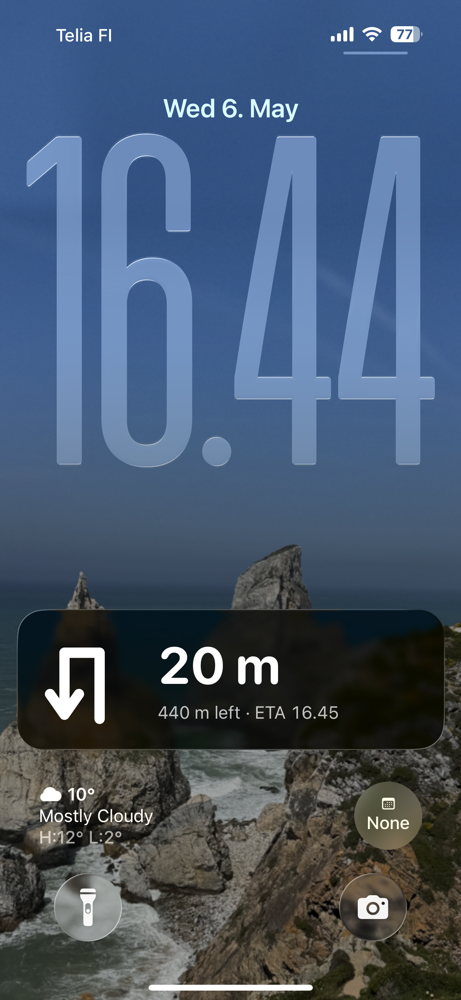

# ESP32 Bike Minimap

This is a bike and hike map application, focused mainly on ease of use when on the bike. An ESP32 based map screen (like a bike computer or a handheld GPS) is an optional and aditional tool that should help navigating instead of using your phone.

Main features of this application is:

- Proper camera for riding (heading direction up) and exploring mode (north up)
- Visible useful POIs for cycling and hiking
- Audio cues for navigation
- iOS and Android navigation guide from lock screen
- Using BRouter.de and OSM router to get best cycling and walking routes
- Support for importing GPX files or Google maps links (link to destination, not the route)
- Support using Digitransit (HSL) route planner in Finland to get best cycling and walking routes
- Secure connection to ESP32 handheld and passing route to it
- Many languages support (Machine translated)

- Web version of the app (There might be issues with background locations, due to OS limitations): <https://map.fiksu.me>
- ESP32 Web Emulator: <https://map.fiksu.me/emulator>
- iOS app: `companion-ios/`
- Android app: `companion-android/`

     

## Hardware [Optional]

- Target device: Waveshare ESP32-P4-WIFI6-Touch-LCD-3.4C (3.4")
- Product page: <https://www.waveshare.com/esp32-p4-wifi6-touch-lcd-3.4c.htm>

## Dev Setup (Dev Container)

Recommended flow is VS Code Remote SSH + Dev Containers.

1. Open this repo in VS Code.
2. Run `Dev Containers: Reopen in Container`.
3. Use the container terminal for all commands below.

## Run Dev (All Projects)

From repo root:

ESP32 Firmware:

- Emulator (Rust + web): `cargo xtask emu`
- Firmware bundle image: `cargo xtask bundle-device`
- Firmware direct flash: `cargo xtask deploy-device --port /dev/ttyUSB0`

Companion projects:

- Web companion:
  ```bash
  cd companion-web
  npm install
  npm run dev
  ```
- iOS companion:
  ```bash
  cd companion-ios
  brew install xcodegen
  cp Config/Signing.local.example.xcconfig Config/Signing.local.xcconfig
  xcodegen generate
  open ESP32MapCompanion.xcodeproj
  ```
- Android companion:
  ```bash
  cd companion-android
  ./gradlew lintDebug testDebugUnitTest assembleDebug
  ```

## Docker Compose

`compose.yaml` serves both apps from one container:

- `/` -> companion web
- `/emulator/` -> emulator

Commands:

```bash
docker compose up --build -d
docker compose logs -f emulator-web
docker compose down
```

Default port is `4173` (override with `EMULATOR_PORT`).

## Make a Map for ESP32 Handheld Device

Source dataset (MapTiler):
<https://www.maptiler.com/on-prem-datasets/europe/finland/helsinki/>

1. Download your map `.mbtiles` file.
2. Put it in `map-src/` (example: `map-src/helsinki.mbtiles`).
3. Convert to runtime map:
   ```bash
   cargo run -p map-vector-cli -- \
     convert-mbtiles \
     --input map-src/helsinki.mbtiles \
     --output map-data/city.svm \
     --target-zoom 16 \
     --profile bike
   ```
4. Create smaller flash-friendly map:
   ```bash
   cargo run -p map-vector-cli --release -- \
     shrink-svm --input map-data/city.svm \
               --output map-data/city-small.svm \
               --max-segments 400000
   ```

## Flash Firmware to ESP32-P4

General flow:

1. Build firmware image:
   ```bash
   cargo xtask bundle-device
   ```
2. Flash app image to device:
   ```bash
   espflash write-bin --chip esp32p4 --port <PORT> 0x0 .xtask/device/firmware-release-app.bin
   ```
3. Flash map partition:
   ```bash
   espflash write-bin --chip esp32p4 --port <PORT> 0x400000 map-data/city-small.svm
   ```
4. Monitor logs:
   ```bash
   espflash monitor --chip esp32p4 --port <PORT>
   ```

## Translations (i18n)

- Main source language file: `i18n/locales/en.json`
- Locale config: `i18n/catalog.config.json`

Before commit, run:

```bash
cargo xtask i18n-gen
cargo xtask i18n-sync-all
cargo xtask i18n-gen
```

For one locale only:

```bash
cargo xtask i18n-sync --locale fi
```
